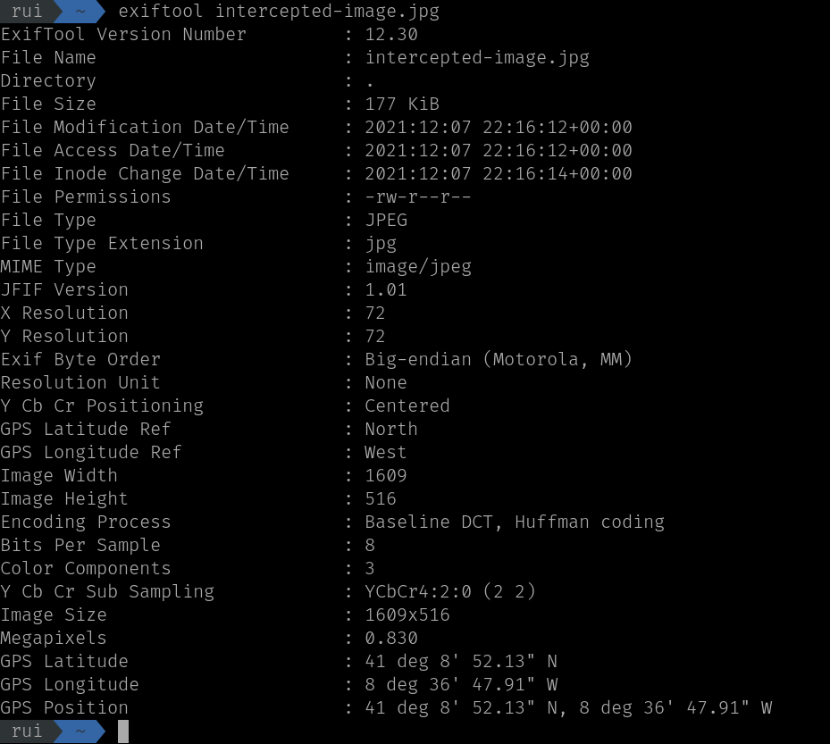

# Francesinha

Using `exiftool`, we can see the location in which the photo was taken.

Searching the GPS position in Google Maps, we can see that the location is Café Aviz.

Therefore, the flag is `TPAS{Café Aviz}`.