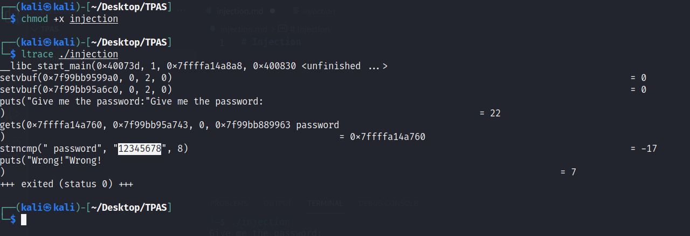
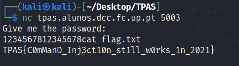

# Injection

By running `ltrace` on the binary, we can see that the password is 12345678.



Checking this binary in [Ghidra](https://github.com/NationalSecurityAgency/ghidra), we can see the following:

```c
undefined8 main(void)

{
  int iVar1;
  long in_FS_OFFSET;
  char local_58 [16];
  undefined8 local_48;
  undefined8 local_40;
  undefined8 local_38;
  undefined8 local_30;
  long local_20;

  local_20 = *(long *)(in_FS_OFFSET + 0x28);
  local_48 = 0x7461632f6e69622f;
  local_40 = 0x2e74657263657320;
  local_38 = 0x747874;
  local_30 = 0;
  setvbuf(stdin,(char *)0x0,2,0);
  setvbuf(stdout,(char *)0x0,2,0);
  puts("Give me the password:");
  gets(local_58);
  iVar1 = strncmp(local_58,"12345678",8);
  if (iVar1 == 0) {
    system((char *)&local_48);
  }
  else {
    puts("Wrong!");
  }
  if (local_20 != *(long *)(in_FS_OFFSET + 0x28)) {
                    /* WARNING: Subroutine does not return */
    __stack_chk_fail();
  }
  return 0;
}
```

Thus, we have to find the offset between `local_58` (our input) and `local_48` (command that is run) so that we can inject the command we want to run.

After finding out the correct offset (= 8), we can then get the flag, which, as we can see, is TPAS{C0mManD_Inj3ct10n_st1ll_w0rks_1n_2021}.


