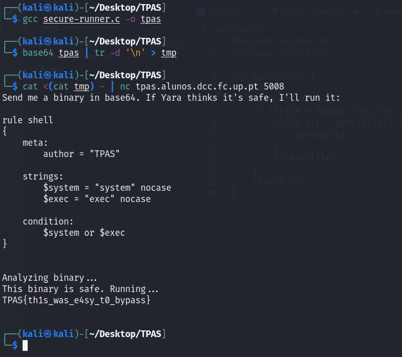

# Secure Runner

By running `nc tpas.alunos.dcc.fc.up.pt 5008`, we can see the following YARA rule:

```
rule shell
{
    meta:
        author = "TPAS"

    strings:
        $system = "system" nocase
        $exec = "exec" nocase

    condition:
        $system or $exec
}
```

Thus, we know that the binary cannot contain the strings `system` or `exec`.

We then write a C program to read the `flag.txt` file.

```c
#include <dirent.h>
#include <stdio.h>

int main(void) {
    int c;
    FILE *file;
    if ((file = fopen("flag.txt", "r"))) {
        while ((c = getc(file)) != EOF) {
            putchar(c);
        }
        fclose(file);
    }
    return (0);
}
```



As we can see, the flag is TPAS{th1s_was_e4sy_t0_bypass}.