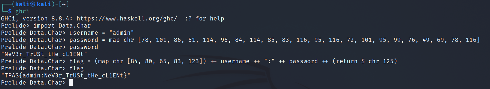

# The Client Side

Inspecting the file, we can see the following

```php
<script>
$("#form").submit(function(event) {
	var username = $("#username").val();
	var password = $("#password").val();
	if (sha256(username) === "8c6976e5b5410415bde908bd4dee15dfb167a9c873fc4bb8a81f6f2ab448a918") {
		if (password === String.fromCharCode(78, 101, 86, 51, 114, 95, 84, 114, 85, 83, 116, 95, 116, 72, 101, 95, 99, 76, 49, 69, 78, 116)) {
			var flag = String.fromCharCode(84, 80, 65, 83, 123) + username + ":" + password + String.fromCharCode(125);
			alert(flag);
			console.log(flag);
		}
		else {
			alert("Invalid password");
		}
	}
	else {
		alert("Invalid username");
	}
	event.preventDefault();
});
</script>
```

Thus, we know that the SHA-256 hash value of the username is 8c6976e5b5410415bde908bd4dee15dfb167a9c873fc4bb8a81f6f2ab448a918.

By running the following command, we can see that the SHA-256 hash value of the string `admin` is
8c6976e5b5410415bde908bd4dee15dfb167a9c873fc4bb8a81f6f2ab448a918, _i.e._ the value we wanted. In other
words, the username is `admin`.

```sh
$ echo -n "admin" | sha256sum
8c6976e5b5410415bde908bd4dee15dfb167a9c873fc4bb8a81f6f2ab448a918
```

We also know that the ASCII values of the characters in the password are 78, 101, 86, 51, 114, 95,
84, 114, 85, 83, 116, 95, 116, 72, 101, 95, 99, 76, 49, 69, 78 and 116 respectively. Therefore, using
Haskell's `chr` function, these can be mapped into the corresponding character. As we can see, the
password is `NeV3r_TrUSt_tHe_cL1ENt`. Following the same process for the flag, we can see that the
flag is `TPAS{admin:NeV3r_TrUSt_tHe_cL1ENt}`.


